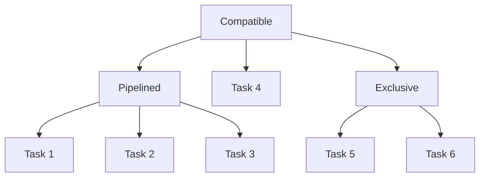

# Tasks

To classify and abstract common NLP functionalities, INTELMO adopts the concept of tasks. From a Python interface perspective, each task is a function that satisfies specific constraints. For a single-task model, INTELMO allows defining rendering using the Python API. For multi-task models, INTELMO provides [Composition](#task-composition) to define interactions between tasks.

## Task Definition

What can a task function get from INTELMO and what should it return? The answer is intuitive: a task function could get an `Article` object and should return a new `Article` object. The `Article` has the following fields that the function can access:

- **`title`**: The title of the article.
- **`url`**: The original URL of the article.
- **`blocks`**: A list of blocks. See [Block Section](/concepts/block) for more details.
- **`global_block`**: A block with `global` level. See [Block Section](/concepts/block) for more details.

With the above fields, a task function can modify the content of the article and return a new article. Here is an example:

```python
def task(article: Article) -> Article:
    article.title = "New Title"
    article.blocks[0].content = "New Content"
    article.global_block = Block(
        level="global",
        type="bold",
        content="New Global Content",
        children=[]
    )
    return article
```

INTELMO provides a set of predefined tasks to simplify the integration of INTELMO into existing NLP models. These tasks have simplified parameters and return types. See [Built-in Tasks Section](/tasks/insertion) for more details.

## Task Composition

When implementing multiple tasks, developers may want to specify the execution order and logic between these tasks. Intelmo categorizes this into three types: `Exclusive`, `Pipelined`, and `Compatible`. Their definitions are as follows:

- **`Exclusive`**: When multiple tasks are `Exclusive`, only one of them can be executed at a time. When user turns on one task, other tasks will be disabled. This type of composition is useful to avoid conflicts between tasks.

- **`Pipelined`**: When multiple tasks are `Pipelined`, they will be executed in the order specified by developer. This type of composition is useful to build a pipeline of tasks.

- **`Compatible`**: When multiple tasks are `Compatible`, they can be executed at the same time and their results will be merged. INTELMO has a built-in mechanism to merge results, but developers can also customize the merging logic.

These compositions could also be nested and make up a tree structure. Here is an example:

```python
server = create_server(
    name="Example Server",
    description="An example server",
    tasks=Compatible(
        Pipelined(
            { Task 1 },
            { Task 2 },
            { Task 3 }
        ),
        { Task 4 },
        Exclusive(
            { Task 5 },
            { Task 6 }
        ),
    )
  )
```

In the above example, `Task 1`, `Task 2`, and `Task 3` will be executed in order. `Task 4` will be executed after `Task 1`, `Task 2`, and `Task 3`. `Task 5` and `Task 6` will be executed exclusively.

The tree structure of the above example is as follows:


